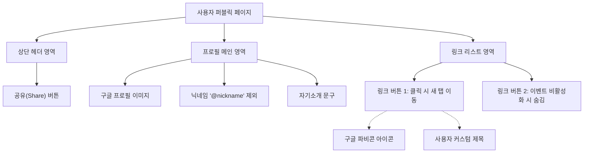
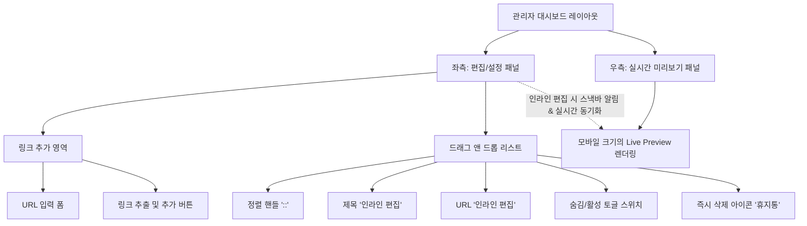

# 마이링크 (MyLink) 화면 와이어프레임 설계

마크다운, Mermaid 컴포넌트 다이어그램, 그리고 ASCII 아트 스타일을 결합하여 설계한 와이어프레임 초안입니다.

---

## 1. 퍼블릭 방문자 뷰 (Public Profile View)
방문자가 모바일 환경에서 접속했을 때 마주하게 되는 화면의 구조와 레이아웃입니다.

### 1.1 레이아웃 계층 구조 (Mermaid)


### 1.2 모바일 화면 와이어프레임 (ASCII Art)
```text
+-----------------------------------+
|                           [ 공유 ]|
|                                   |
|            ( Google )             |
|            ( 이미지 )             |
|                                   |
|              nickname             |
|         여기에는 사용자가 작성한  |
|         짧은 자기소개가 표시됨.   |
|                                   |
|                                   |
|  +-----------------------------+  |
|  |  [ F ]  유튜브 VLOG 채널    |  |
|  +-----------------------------+  |
|                                   |
|  +-----------------------------+  |
|  |  [ F ]  인스타그램 (Instagram)  |  |
|  +-----------------------------+  |
|                                   |
|  +-----------------------------+  |
|  |  [ F ]  내 포트폴리오 사이트|  |
|  +-----------------------------+  |
|                                   |
|                                   |
|          ⚡ Powered by MyLink      |
+-----------------------------------+
*[ F ] : 구글 API로 연동된 자동 파비콘
```

---

## 2. 관리자 대시보드 (Admin Dashboard)
사용자가 프로필과 링크를 설정하는 PC/Tablet 기반의 좌우 분할 관리자 화면입니다.

### 2.1 관리자 대시보드 컴포넌트 구조 (Mermaid)


### 2.2 데스크탑 화면 와이어프레임 (ASCII Art)
```text
+-------------------------------------------------------------------------+
| [ MyLink 로고 ]                     [ 대시보드 ] [ 통계 ]   [ 로그아웃 ]|
+-------------------------------------------------------------------------+
|                        |                                                |
|  ✏️ 내 링크 관리         |              ✨ 실시간 미리보기 영역           |
|                        |                                                |
| [추가할 URL을 입력하세요..............] |    +-----------------------+    |
| +-------------------------+             |    |               [공유]  |    |
| |  [+] 새 링크 만들기     |             |    |     ( Google )        |    |
| +-------------------------+             |    |     ( 이미지 )        |    |
|                                         |    |                       |    |
| ======================================= |    |        nickname       |    |
|                                         |    |     [짧은 소개글...]  |    |
| [::] 유튜브 브이로그 채널 (클릭해 수정) |    |                       |    |
|      https://youtube.com/... (클릭)     |    | +-------------------+ |    |
|      (Toggle: 활성)         [휴지통]    |    | | [F] 유튜브 브이로그| |    |
| --------------------------------------- |    | +-------------------+ |    |
|                                         |    | +-------------------+ |    |
| [::] 내 인스타그램 소식 (클릭해 수정)   |    | | [F] 내 인스타그램 | |    |
|      https://instagram.com/... (클릭)   |    | +-------------------+ |    |
|      (Toggle: 활성)         [휴지통]    |    |                       |    |
| --------------------------------------- |    |                       |    |
|                                         |    |   ⚡ Powered by MyLink |    |
| [::] 잠시 숨겨둔 블로그                 |    +-----------------------+    |
|      https://velog.io/...               |                                 |
|      (Toggle: 비활성)       [휴지통]    |                                 |
|                                         |                                 |
+-------------------------------------------------------------------------+
*(좌측 리스트의 텍스트를 클릭하면 즉시 입력 폼으로 바뀌어 인라인 편집이 가능하며, 
우측 화면에 타이핑하는 즉각적인 결과가 반영됩니다.)
```
